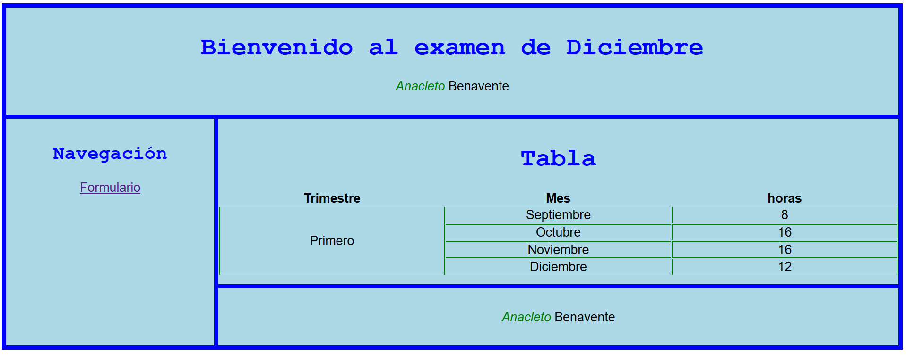

[](https://classroom.github.com/a/pyNIxwlf)
# Examen UD2-UD3: HTML y CSS

Descarga este repositorio y elabora el sitio según las instrucciones de este README. Se adjuntan
- Pantallazos
- Ficheros html

Instrucciones:
1. Activa e indica aquí el hosting del repositorio [Hosting](https://fluffy-barnacle-evgw2p5.pages.github.io/)
2. Crea los ficheros para incluir el contenido por un lado y el formato por el otro. Serán 3 en total
3. Utiliza la etiqueta html pertinente para indicar tu nombre y apellidos
4. Utiliza un comentario al principio del .css para indicar tu nombre y apellidos
5. Valida ambos html
6. Se adjuntan dos pantallazos del sitio

## index.html
1. Dentro de un contenedor div se distribuyen los elementos mediante la distribución en rejilla (3x6), y más concretamente 
con un template area. La distribución es la siguiente:
```console
cabecera cabecera cabecera cabecera cabecera cabecera
barra-nav principal   principal   principal   principal   principal
barra-nav pie pie pie pie pie
```
   - Existe una separación (gap) de 10 píxeles, y un relleno de otros 10. El color de fondo es azul
2. Cada una de las secciones (etiquetas semánticas) tienen un azul claro de fondo y un relleno de 20 píxeles arriba y abajo. 
El texto tiene tamaño de 30 píxeles y está centrado
1. Toda la fuente es arial
2. Hay 3 h1. Se visualizan de azul y con fuente courier
3. Cada vez que aparezca el párrafo "Anacleto Benavente" cámbialo por tu nombre y apellido. Tu nombre debe aparecer
   - En el título de la página
   - En el formulario
   - En el pie de página 
4. El nombre "Anacleto" (aparece dos veces) está oblicuo y de color verde
5.  La tabla ocupa el 100% de su contenedor
6.  El enlace "Formulario" navega hacia otra página "formulario.html"

|  |
|-|


## formulario.html
1. Dentro del **formulario**:
   1. El método de envío del formulario debe ser GET. El destino del envío del formulario debe ser "#".
   2. La caja de texto de nombre tiene una sugerencia
   3. Puede seleccionarse uno de los tres meses: Enero, Febrero o Marzo. Este último seleccionado por defecto. Los valores enviados serán en, fe, ma.
   4. La caja de verificación está seleccionada por defecto
   5. El formulario ocupa el 30% de la página, y tiene un borde de tres píxeles color verde. Las cuatro esquinas tienen un redondeo del 5%. Ponle un relleno para que quede como el de la imagen
   6. Las etiquetas, y mediante css, tienen un retorno de carro y un pequeño espacio arriba

|  |
|-|
