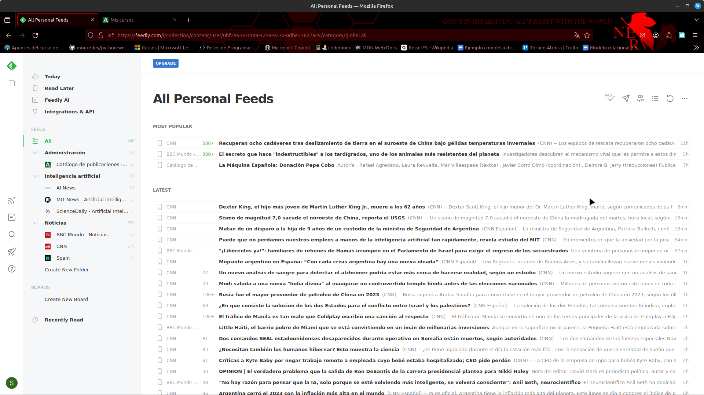
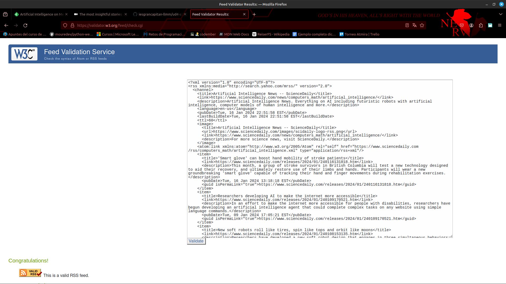
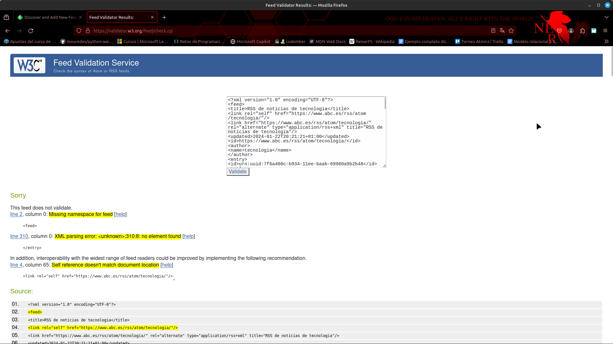

# Tarea A1
Mi feedly:

## RSS 
Podemos ver que el documento RSS cumple la validación:

Por otra parte podemos ver que hace uso de las etiquetas clasicas de RSS:

1. channel
2. item
3. title
4. link
5. description
6. pubDate
7. lastBuildDate
8. ttl
9. image
10. url
11. guid

[Link al RSS](./artificial_intelligence.xml)

## Atom
En el caso de atom podemos ver que NO cumple la validación:

Las etiquetas usadas de nuevo son las típicas:

1. feed
2. title
3. link
4. updated
5. id
6. author
7. name
8. entry
9. summary

[Link al Atom](./atom.xml)